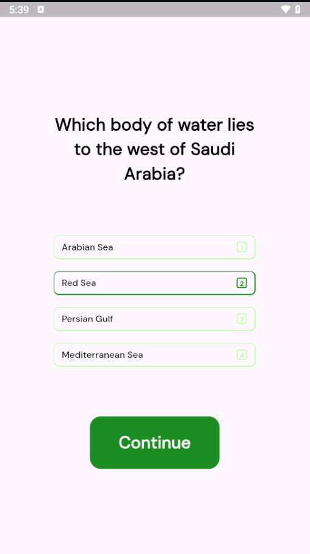
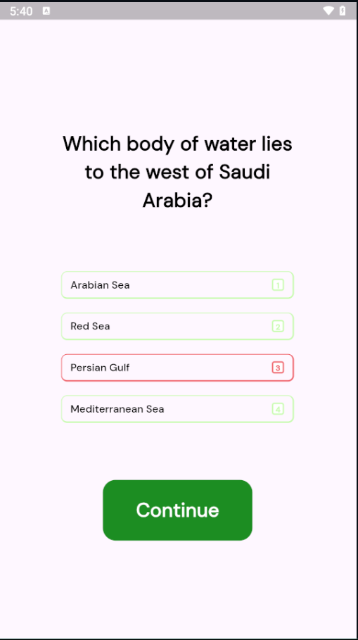
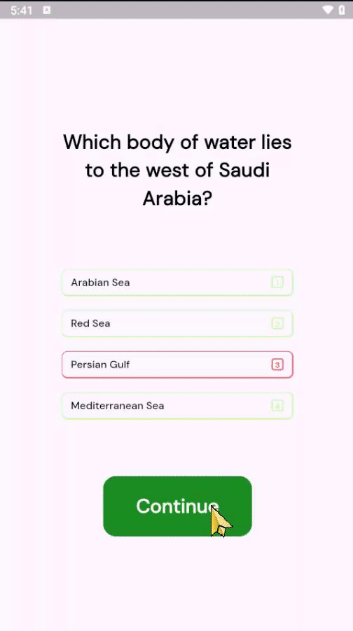

# Saudi Arabia Quiz App

This is a Flutter-based quiz app that tests users' knowledge about Saudi Arabia. The app presents multiple-choice questions and keeps track of the user's score.

## Features

- Multiple-choice questions about Saudi Arabia
- Tracks and displays the user's score
- Data persistence using `GetStorage`

## Logic and Functionality

### Quiz Flow

1. **Question Display**: 
   - The app retrieves the current question from the `QuestionsData` and displays it on the `QuestionsScreen`.
   - Each question has four possible answers, displayed as buttons.

2. **Answer Selection**:
   - The `isLocked` boolean is set to `false`, allowing the "Continue" button to be clickable.

3. **Continue Button**:
   - The "Continue" button is initially locked (`isLocked = true`).
   - It becomes clickable only after an answer has been selected (`isLocked = false`).

4. **Navigating to the Next Question**:
   - If all questions are answered, the app navigates to the `WinnerScreen` to display the final score.

5. **Data Persistence**:
   - The app uses `GetStorage` for persisting quiz data such as the current question index and score.
   - This ensures that the user's progress is saved across app restarts.

## Screenshots

## Future Improvements

- Add more questions to the quiz.
- Implement a timer for each question.
- Enhance the UI with animations and transitions.
- Add user authentication and leaderboards.

## Contact

For any questions or suggestions, please feel free to reach out via [Aziiz](mailto:azooz.n40@hotmail.com).

